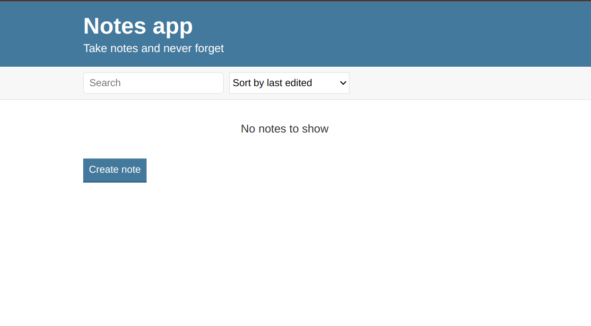

# VaultBoy Notes Application (2019)

I began seriously developing my IT skills in 2019 when I took my first JavaScript course. This was the foundation of my journey into programming. My first major project was the VaultBoy Notes Application in 2019, where I applied the skills I was learning to create a functional and interactive web application.

## Notes App Installation Guide

Follow these steps to run the Notes App:

### 1. Clone the Repository

If you haven't already, clone the repository to your local machine:

```
git clone https://github.com/Thevaultboy11/Notes-Application-2019.git
```

### 2. Navigate to the Project Directory

Change to the project directory:

```
cd notes_app
```

### 3. Open the `index.html` File

You can now open the `index.html` file in your browser. You can do this in multiple ways:

- **Option 1:** Open directly in your browser by double-clicking `index.html`.
- **Option 2:** Use the terminal to open it in your default browser:

    - For **macOS**:
    ```
    open index.html
    ```

    - For **Linux**:
    ```
    xdg-open index.html
    ```

    - For **Windows**:
    ```
    start index.html
    ```

That's it! Your Notes App should now be running in your browser.